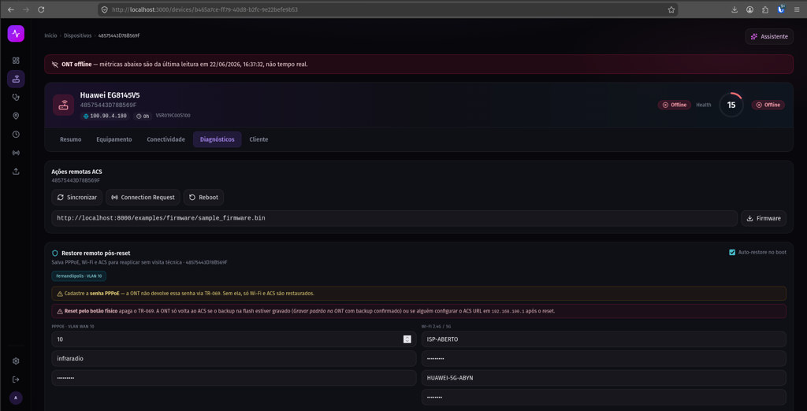

# Aba Diagnósticos — Ações remotas e restore

Painel de diagnósticos e provisionamento remoto da ONT via TR-069/GenieACS: sync, connection request, reboot, firmware e restore pós-reset.

## O que a tela mostra

| Área | Descrição |
|------|-----------|
| **Banner offline** | Aviso quando a ONT não informa ao ACS — métricas são da última leitura |
| **Cabeçalho** | Modelo, serial, IP WAN, health score e status online/offline |
| **Ações remotas ACS** | Sincronizar, Connection Request, Reboot e upload de firmware |
| **Restore remoto pós-reset** | Perfil salvo (PPPoE, Wi-Fi, ACS) reaplicado no BOOT da ONT |
| **Configuração** | PPPoE, VLAN, Wi-Fi e credenciais ACS editáveis antes de gravar na ONT |

## Exemplo nesta captura

- **Dispositivo:** Huawei EG8145V5
- **Status:** ONT offline · health score baixo
- **Perfil:** Fernandópolis — auto-restore no boot habilitado

## Observação

Quando a ONT está offline, comandos (sync, Wi-Fi, speed test) ficam na fila do GenieACS e aplicam no próximo Inform (~30s) ou após Connection Request bem-sucedido.