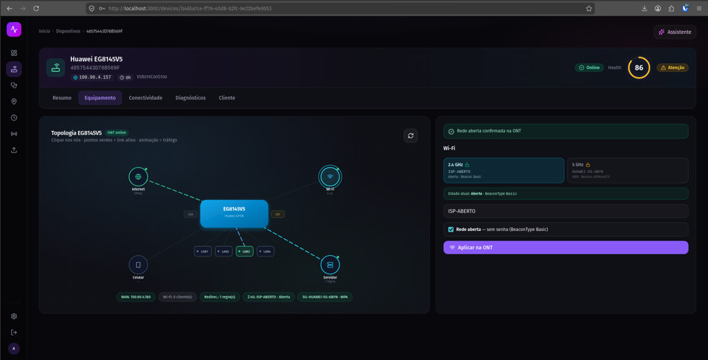

# Aba Equipamento — Topologia EG8145V5

Visão interativa da ONT Huawei EG8145V5 no painel Inspear: topologia de rede, portas LAN, Wi-Fi e redirecionamento de porta.

## O que a tela mostra

| Área | Descrição |
|------|-----------|
| **Topologia** | Nós clicáveis — Internet, Wi-Fi, portas LAN 1–4, Celular, Servidor |
| **ONT central** | EG8145V5 com status online e links ativos (linhas verdes) |
| **Badges inferiores** | WAN, clientes Wi-Fi, regras de redirecionamento, SSID 2.4G/5G |
| **Painel Wi-Fi** | Configuração de rede aberta (`BeaconType Basic`) ou com senha |
| **Confirmação** | Banner verde quando a ONT aplica a alteração com sucesso |

## Exemplo nesta captura

- **Dispositivo:** Huawei EG8145V5
- **Wi-Fi 2.4G / 5G:** rede aberta (`BeaconType Basic`)
- **Status:** ONT online

## Homologação

ONT de referência para testes TR-069: **Huawei EG8145V5**.

Ver também: [Diagnósticos e restore remoto](diagnosticos.md).